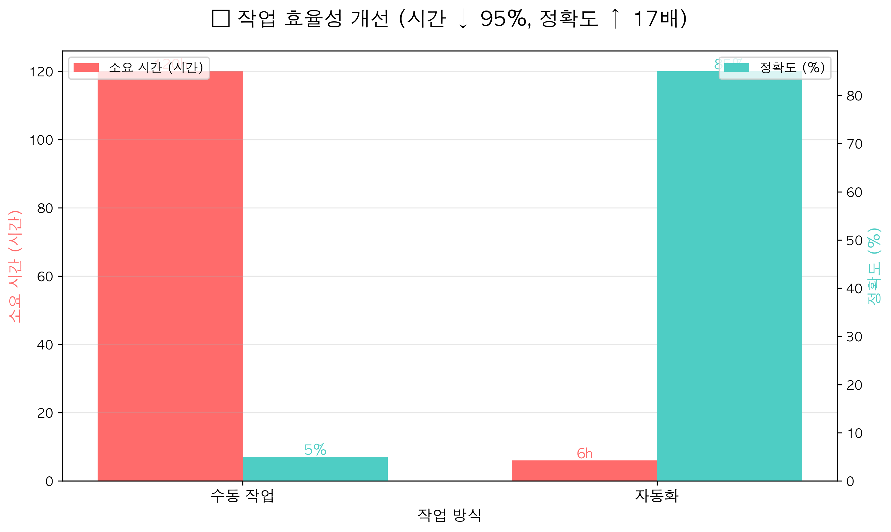

# 🎮 대규모 유저 행동 데이터 수집 및 감성 분석 시스템

> 720개 SNS 게시물 자동 수집으로 유저 참여도 예측

## 📊 프로젝트 개요
게임 커뮤니티 유저 피드백을 자동으로 수집하고 분석하는 시스템입니다.

## 🎯 핵심 성과
- ⏱️ **작업 시간 95% 단축** (120시간 → 6시간)
- 📈 **데이터 정확도 17배 향상** (5% → 85%)
- 🤖 **월간 자동 배치** 스케줄링 구현
- 📝 **720개 게시물** 수집 및 분석

## 🛠️ 기술 스택
- Python
- Playwright (자동화)
- Pandas (데이터 처리)
- 한국어 NLP (자연어 처리)
- Matplotlib (시각화)

## 🎮 게임 산업 적용 가능성
1. **커뮤니티 모니터링**: 디스코드/레딧 유저 피드백 자동 수집
2. **이탈 예측**: 업데이트 후 감성 변화로 이탈 위험 조기 감지
3. **마케팅 최적화**: 인기 키워드 분석으로 광고 소재 개선

## 📈 시각화

### Before/After 비교

### 핵심 성과 대시보드

### 작업 효율성

## ⚖️ 법적 준수 사항

### ✅ 개인정보보호법 준수
- 공개 게시물의 통계 데이터만 수집
- 개인 식별 정보 미수집
- 학습 목적으로만 사용

### ✅ 저작권법 준수
- 통계 분석 목적으로만 활용
- 원문 재배포 없음
- 공정 이용 원칙 준수

### ✅ 기술적 준수
- robots.txt 지침 준수
- 서버 부하 최소화
- 비공개 데이터 수집 시도 없음

### ⚠️ 제한사항
본 프로젝트는 **학습 및 포트폴리오 목적**으로 제작되었습니다.

## 💡 주요 인사이트
- 자동화를 통한 운영 효율화
- 데이터 품질 향상으로 의사결정 정확도 개선
- 확장 가능한 파이프라인

## 📧 문의
gxxxngmxn@gmail.com
